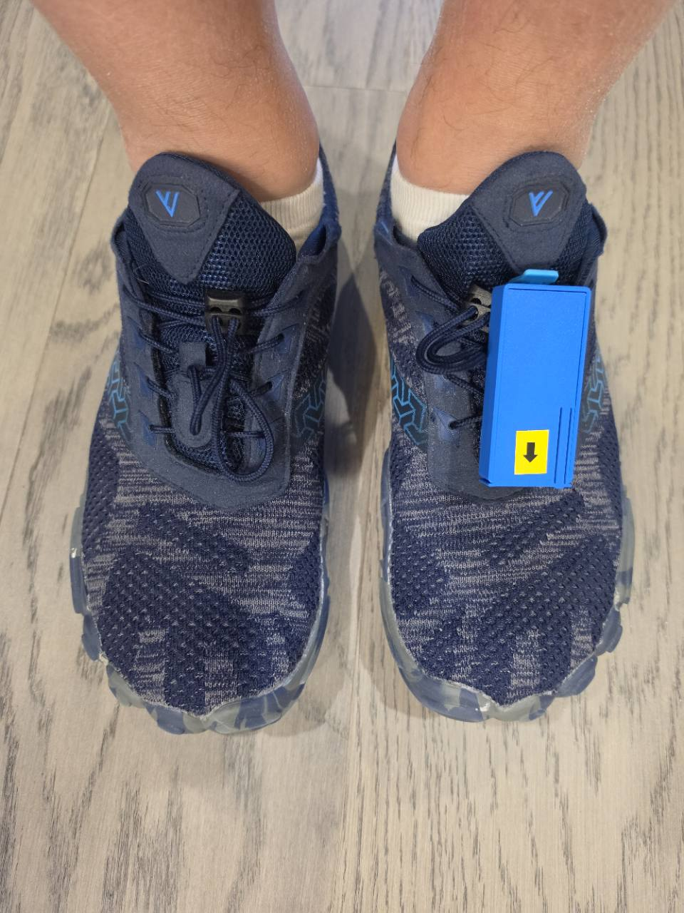
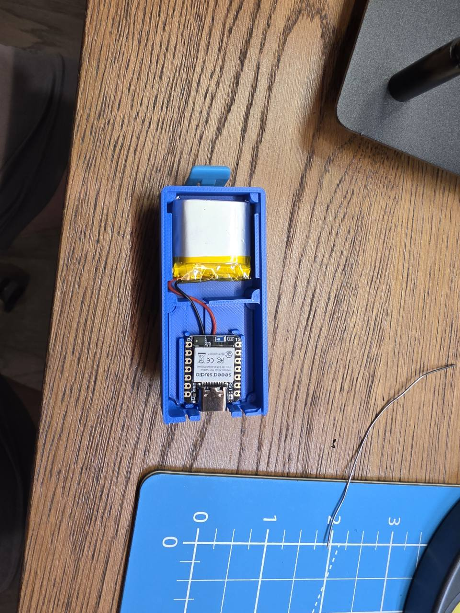
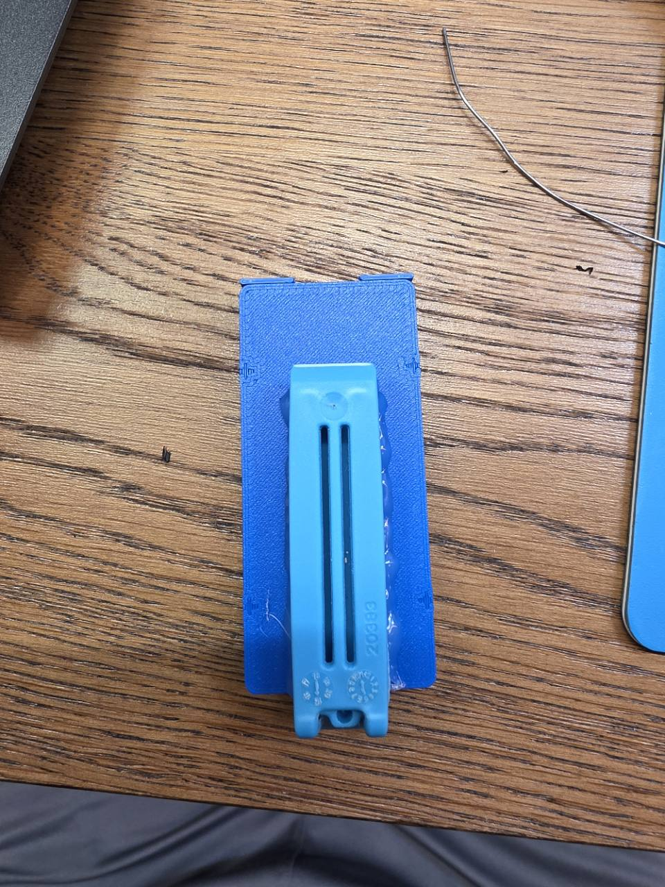
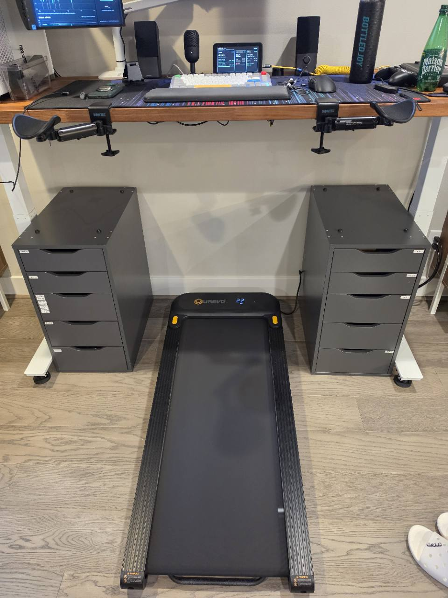
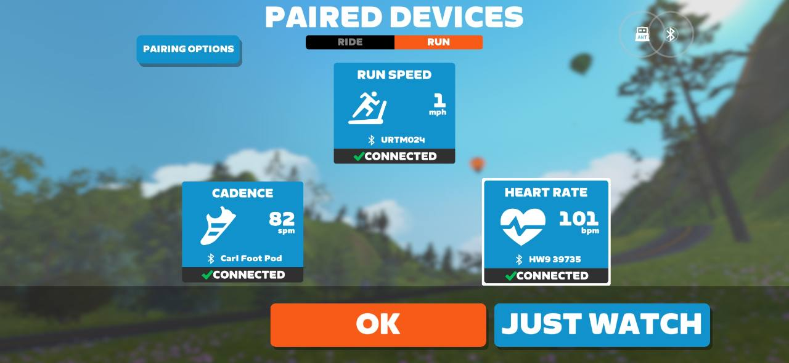
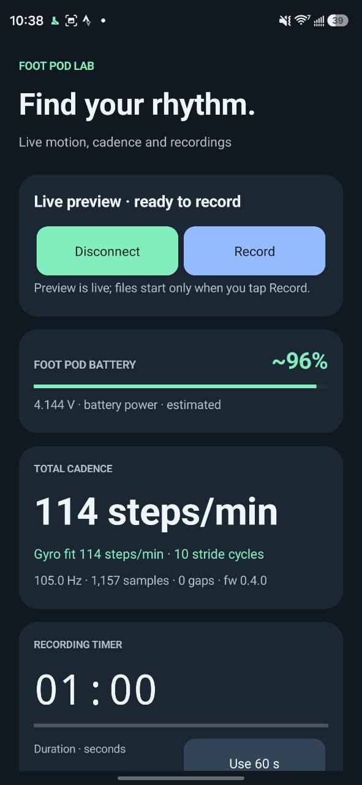
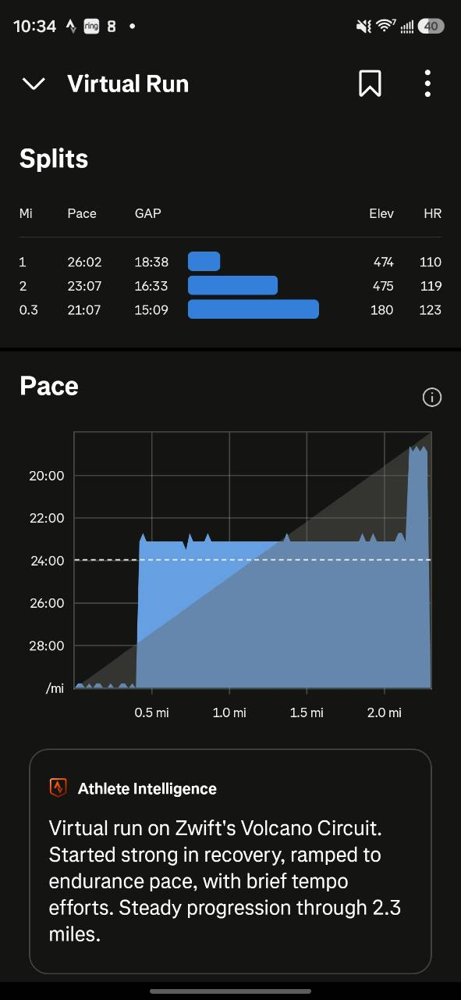
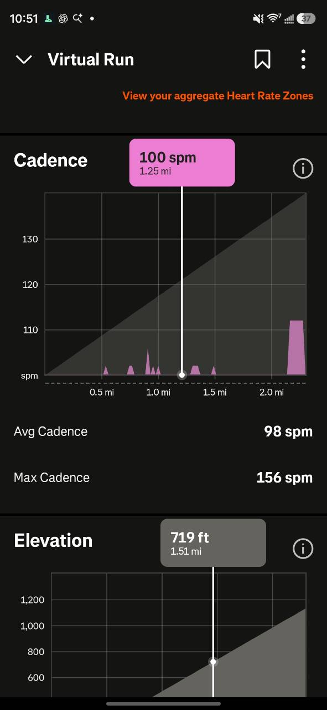

# Carl Foot Pod

A battery-powered foot pod built around the **Seeed XIAO nRF52840 Sense**.
It estimates walking cadence from the on-board gyroscope and publishes it directly
to **Zwift over Bluetooth**. **Foot Pod Lab** on Android previews the six-axis IMU,
records sessions for algorithm development, and reads the pod’s battery voltage
and estimated charge level.

**Firmware:** 0.4.0 · **Android app:** 1.0.1 · **BLE name:** `Carl Foot Pod`

<p>
  
  
</p>

The assembled pod clips over the shoelaces. Inside the blue case are the XIAO
board and a pouch battery. The yellow arrow marks the mounting orientation used
for this setup; keep the sensor orientation consistent when comparing recordings.

## Mounting and walking-desk setup

<p>
  
  
</p>

The rear view shows the long mounting clip attached to the case, complementing
the photo of the pod on the shoelaces above. Secure the case so it stays in the
same orientation during walking and recording.

The second photo shows the walking pad under the standing desk, with displays,
a keyboard and arm supports. This is the physical setup used alongside the shoe
pod, Zwift and the phone companion.

The [V5 enclosure design](enclosure/README.md) is now included: printable STLs,
editable STEP/CadQuery files, previews and the original print/assembly guide.
Download the [exact enclosure package](enclosure/low-profile-v5-package.zip) or
browse the [individual parts](enclosure/low-profile-v5/).

## What it does

- Computes cadence on the pod, without a computer or phone relay, and publishes
  Running Speed and Cadence (RSC) notifications once per second.
- Supports two BLE central connections so Zwift and a companion on another device
  can connect. Starting or stopping the companion’s IMU stream leaves cadence publishing active.
- Streams timestamped gyro X/Y/Z and accelerometer X/Y/Z samples at roughly 104 Hz.
- Separates **Connect** for live preview from **Record** for saving a new session.
- Shows battery voltage and an estimated percentage, including a dedicated battery
  bar with charging status and low-battery colors.
- Saves raw IMU data, gyro fit results and reference annotations; retains partial
  captures if recording ends unexpectedly.

Use this pod as a **cadence source**. The speed field required by RSC currently
uses a placeholder 0.70 m step length. Keep the treadmill or another measured
speed source under Zwift’s **RUN SPEED**.

## Get the firmware and app

| Component | Download / source |
| --- | --- |
| V5 enclosure | [Original package](enclosure/low-profile-v5-package.zip) · [Design and print guide](enclosure/README.md) |
| Firmware 0.4.0 | [GitHub release, DFU package, HEX and validation](https://github.com/carlren/zwift-foot-pod/releases/tag/v0.4.0) |
| Android app 1.0.1 | [GitHub APK release](https://github.com/carlren/zwift-foot-pod/releases/tag/android-v1.0.1) · [APK on Google Drive](https://drive.google.com/file/d/1NDdZ-bwayQZ8dlKcvDCeHdjqc7yNuZNr/view?usp=drivesdk) |
| Android source and instructions | [android/README.md](android/README.md) |
| Desktop collection, build and protocol details | [Development guide](docs/development.md) |

The repository and its GitHub release downloads are private. The releases are
marked prerelease while broader mounting, gait, runtime and simultaneous-device
stress testing remain unfinished. Firmware 0.3.0 and Android 1.0.0 remain in the
release history.

## Pair with Zwift

1. Power the pod and keep it mounted in the same orientation used for calibration.
2. Open Zwift’s **RUN** pairing screen.
3. Select **Carl Foot Pod** under **CADENCE**.
4. Keep the treadmill or other speed source under **RUN SPEED**.
5. Allow a few walking strides for the cadence estimate to settle. Standing still
   returns cadence to zero after the stop timeout.



This user-supplied screenshot shows **Carl Foot Pod connected at 82 steps/min**.
Zwift receives run speed separately from **URTM024**, shown at 1 mph. Heart rate
also comes from a separate device.

## Use Foot Pod Lab on Android

Install the APK on the phone and allow **Nearby devices** permission. Allow
notifications for connection and recording status. Updates install over the
existing app using the same signing key; keep the app installed to retain its
private recordings.

1. Tap **Connect**. Preview starts immediately, with no recording files created.
2. Check the live gyro / acceleration graphs, cadence and packet-gap counter.
3. Choose a label and duration, then tap **Record**. Only new samples are saved.
4. The countdown ends the recording automatically. **Stop recording** saves early
   and keeps preview running; **Disconnect** saves an active recording and releases
   the phone’s connection.
5. For a reference measurement, count steps from **both feet**. After recording,
   enter **Counted steps** and choose **Calculate & save reference**. The app uses
   the actual saved duration rather than forcing the requested timer duration.
6. Choose **Share recording ZIP** and select Drive or another sharing destination.
   Each ZIP contains `imu.csv`, `fit.csv` and `session.json`.

<p>
  
</p>

The Galaxy S26 Ultra screenshot shows real **live preview** with firmware 0.4.0:

| Displayed reading | Value in the screenshot |
| --- | --- |
| Pod cadence received over RSC | 114 steps/min |
| Local signed-gyro fit | 114 steps/min |
| IMU stream | 105.0 Hz, 1,157 samples, 0 gaps |
| Foot pod battery | 4.144 V, approximately 96%, battery power |
| Recording state | Preview; **Record** is available; duration set to 60 seconds |

The **Foot pod battery** card refers to the pod, not the phone’s battery shown in
Android’s status bar. Its bar is green above 50%, amber at 21–50%, and red at
0–20%. Unavailable readings show “—”; after disconnecting, retained readings are
labeled “last read”. Percentage is interpolated from a typical LiPo voltage curve,
not measured by a calibrated fuel gauge.

The app receives voltage updates every five seconds and battery percentage change
notifications. It uses a connected-device foreground service and a bounded wake
lock during recording. The supplied screenshot demonstrates preview and battery
reads on the Galaxy; it does not demonstrate a completed or screen-locked recording.
Full app behavior and export details are in [the Android guide](android/README.md).

## Workout example

<p>
  
  
</p>

The supplied Strava screenshot shows a **Virtual Run** with two one-mile splits
and a final 0.3-mile split. Pace and heart rate come from the separate sources
shown in Zwift. The screenshots illustrate the workout and live preview; use the
reference recordings below to assess cadence accuracy. The Zwift and phone images
show different cadence readings without synchronized timestamps for comparison.

The additional Strava **Cadence** screenshot shows cadence in the recorded Virtual
Run: **98 spm average**, **156 spm maximum**, and a selected reading of **100 spm
at 1.25 miles**. These are Strava’s displayed activity values; the manual-reference
recordings below provide the separate accuracy checks.

## How cadence is estimated

The primary signal is **signed Y-axis gyroscope rotation**, matching the current
mounting. Acceleration is available for inspection and correlation, but does not
independently trigger cadence.

The detector applies a 40 ms low-pass filter. Rotation below −20 °/s rearms it;
a subsequent crossing of +40 °/s marks a stride cycle. A 450 ms minimum interval
rejects extra cycles. One complete cycle from a pod on one shoe represents **two
total steps**. The estimate is smoothed and returns to zero after three seconds
without a new cycle.

The same detector is implemented in the [firmware](footpod/cadence.h),
[Android app](android/app/src/main/java/com/carlren/footpod/Protocol.java), and
[desktop dashboard](dashboard.py). Desktop axis / threshold edits affect only the
desktop fit; board constants require rebuilding the firmware. The phone currently
uses the same fixed Y-axis settings as the board.

Five saved one-minute walking recordings were replayed through the actual firmware
C++ detector. Reference values were manually supplied by Carl and do not control
the detector’s result:

| Recording | Reference steps/min | Mean firmware steps/min |
| --- | ---: | ---: |
| [Slower walk 1](recordings/20261006T052553_045206Z_walking/session.json) | 70.5 | 70.66 |
| [Slower walk 2](recordings/20261006T052707_444318Z_walking/session.json) | 71 | 70.40 |
| [2 mph walk 1](recordings/20261006T052902_519778Z_walking/session.json) | 92 | 92.06 |
| [2 mph walk 2](recordings/20261006T053044_112366Z_walking/session.json) | 92 | 92.18 |
| [3 mph walk](recordings/20261006T053216_845529Z_walking/session.json) | 110 | 109.98 |

See [firmware replay results](validation/firmware-algorithm-report.json) and
[Android replay results](validation/android-protocol-report.json). These results
cover this mounting and these walking sessions, not every runner, orientation or
pace. Green markers illustrate detected cycles, not validated touchdown times.

## Validation and current limits

The photos and screenshots are supplied by the user; bench and emulator reports
are saved separately under [`validation/`](validation/).

| Evidence | What it establishes |
| --- | --- |
| [Galaxy live screenshot](docs/images/android-live-preview.jpg) | On-phone BLE preview, RSC cadence, matching local gyro fit, battery reads and a displayed 105 Hz stream with zero gaps over 1,157 samples |
| [Zwift pairing screenshot](docs/images/zwift-pairing.jpg) | Carl Foot Pod connected as Zwift cadence, alongside separate speed and heart-rate sources |
| [Strava cadence screenshot](docs/images/strava-cadence.jpg) | Cadence displayed in the Virtual Run activity: 98 spm average, 156 spm maximum, 100 spm at the selected 1.25-mile point |
| [Firmware 0.4.0 bench report](validation/companion-report.json) | 2,093 samples at 104.995 Hz, zero missing packets, 20 concurrent RSC frames, battery reads / notifications, free-slot advertising and reconnect reset on one physical central |
| [Hardware regression report](validation/report.json) | Sensor identity, sampling, RSC packet format, mock-value transport checks, zero-cadence heartbeat and reconnect |
| [Android app checks](validation/android-app-report.json) | Signed APK, emulator installation / launch, decoder / timing checks, native recording files, ZIP sharing and interruption recovery |
| [Battery-bar update checks](validation/android-battery-bar-report.json) | Signed 1.0.1 update installed over 1.0.0, dedicated battery card and unavailable-state display checked in the emulator |

The phone screenshot extends the earlier emulator-only evidence with real Galaxy
preview on battery power. Battery runtime, a sustained simultaneous phone-plus-Zwift
radio test, and Galaxy screen-lock recording still need logged measurements. The
screenshots alone do not establish those results. No recordings are stored on the
board, and lost radio packets cannot be recovered from it.

## Build and develop

Run these commands from the repository root. `rtk` is the command wrapper used in
this workspace; if it is not installed, omit that prefix.

```sh
rtk .venv/bin/python program.py          # build firmware
rtk .venv/bin/python program.py --upload # flash the connected XIAO Sense
rtk python3 android/build.py            # signed Android APK and lint
rtk .venv/bin/python dashboard.py        # desktop live preview at 127.0.0.1:8766
```

The desktop tools use the dependencies in [`requirements.txt`](requirements.txt).
The firmware toolchain is Arduino CLI 1.4.1 with Seeed nRF52 Boards 1.1.13. Android
uses JDK 17, SDK 35, Gradle 8.10.2 and Android plugin 8.7.2. Setup, protocol UUIDs,
ADC details and hardware checks are in [the development guide](docs/development.md).
Android signing and emulator checks are in [the Android guide](android/README.md).

```sh
rtk .venv/bin/python verify_firmware.py # firmware C++ against reference recordings
rtk .venv/bin/python android/check.py  # actual Java decoder, timer and gyro fit
rtk .venv/bin/python test_dashboard.py # desktop preview / recording boundaries
rtk .venv/bin/python test_companion.py # per-client state and battery curve
```

## Repository contents

| Path | Contents |
| --- | --- |
| [`enclosure/`](enclosure/) | Original V5 package, extracted STL/STEP/CadQuery files, previews and assembly instructions |
| [`footpod/`](footpod/) | Firmware, gyro detector, client isolation and battery curve |
| [`android/`](android/) | Android source, Gradle wrapper, signing build script and instrumentation checks |
| [`dashboard.py`](dashboard.py), [`dashboard.html`](dashboard.html) | Desktop live visualization and recording controls |
| [`collect.py`](collect.py), [`replay.py`](replay.py), [`battery.py`](battery.py) | BLE collection, offline gyro replay and battery reads |
| [`recordings/`](recordings/) | All 20 saved local sessions, including five walking references, bench captures and partial / interrupted checks |
| [`validation/`](validation/) | Bench / replay / emulator reports and desktop screenshots |
| [`docs/images/`](docs/images/) | All eight original user-supplied photos / screenshots, copied without editing |
| [`docs/development.md`](docs/development.md) | Detailed desktop, firmware, Bluetooth and build guide |

Session folders include raw data and any saved fits / annotations. Partial and
synthetic or UI-check sessions are retained with their metadata; they are not all
training references. Replay validation selects the five completed recordings
explicitly annotated with `reference_source = user_reported_count`, excluding
sessions marked `exclude_from_training`.

Source, documentation, photos, validation reports and saved recordings are tracked
in Git. Installable firmware and APKs, source archives and checksums are attached
to the GitHub releases. Toolchain downloads, dependencies, caches and local build
outputs are excluded from Git; private Android signing credentials stay outside
the repository.

## Public-release review

The [public-release audit](docs/public-release-audit.md) found no credential leaks
in the scanned history, enclosure or release contents. The repository still
contains personal author metadata, device identifiers, workout data and photos.
Review those publication choices, select a project license and confirm the
third-party board reference’s redistribution terms before making it public.
