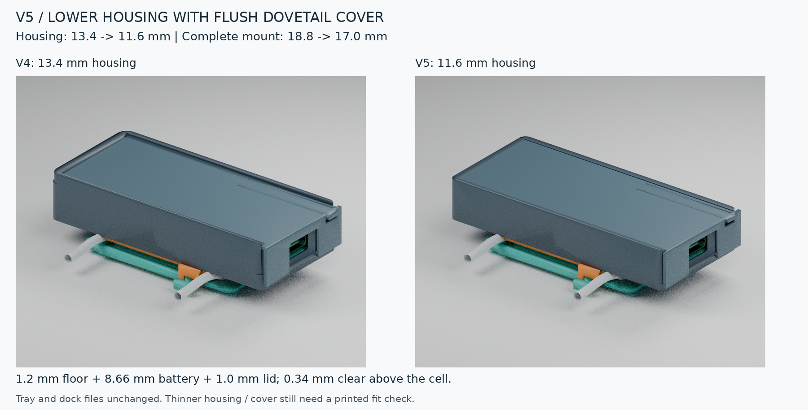
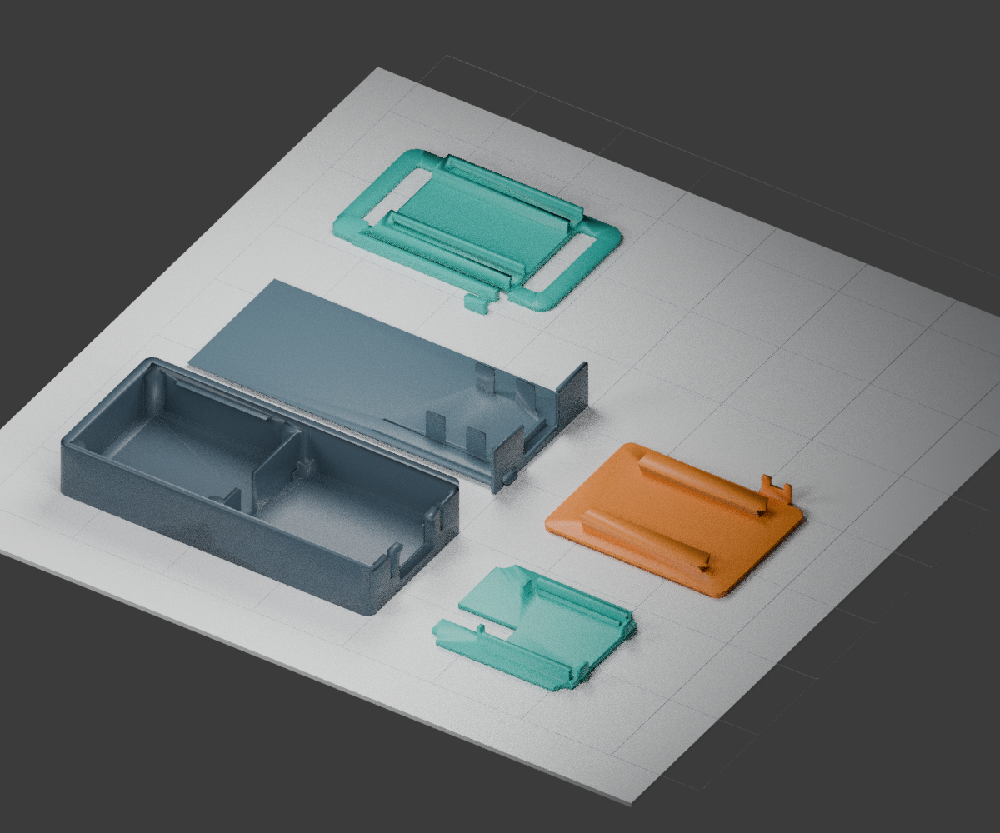

# Low-profile V5 enclosure

Imported from the user-supplied [Drive package](https://drive.google.com/file/d/1o0rKppdrjITLiIJF9fO0QQAxFphHp7R-/view?usp=drivesdk).
The original ZIP and every extracted file are preserved without edits.

- [Download the original package](low-profile-v5-package.zip)
- [Print and assembly instructions](low-profile-v5/PRINT-AND-ASSEMBLE.md)
- [Editable STEP assembly](low-profile-v5/low-profile-v5.step)
- [Parametric CadQuery source](low-profile-v5/design.py)
- [Combined print plate](low-profile-v5/low-profile-v5-print-plate.stl)
- [Packaged CAD validation](low-profile-v5/validation.json)
- [File checksums](SHA256SUMS.txt)



## Print files

| Part | STL |
| --- | --- |
| Housing | [body.stl](low-profile-v5/body.stl) |
| Sliding cover | [sliding-cover.stl](low-profile-v5/sliding-cover.stl) |
| Board carrier | [board-carrier.stl](low-profile-v5/board-carrier.stl) |
| Glue-on adapter | [glue-on-adapter.stl](low-profile-v5/glue-on-adapter.stl) |
| Lace-mounted base | [lace-base.stl](low-profile-v5/lace-base.stl) |



The packaged design specifies a **70 × 32 × 11.6 mm** housing and a roughly
**72 × 36 × 17 mm** mounted assembly. It was designed around a measured
**26.31 × 25.07 × 8.66 mm** battery. Those dimensions and validation statements
come from the supplied CAD package; importing it did not rerun CAD generation or
physical print tests. Follow the original assembly instructions, particularly the
small battery clearance and keeping glue out of the release mechanism.

`design.py` uses CadQuery and trimesh. `render.py` runs in Blender after the geometry
is generated. The `references/` directory retains the fitted reference STLs and
the supplied Seeed XIAO board STEP reference used by the source.

## Provenance and licensing

The imported ZIP's SHA-256 is:

```text
71ce6ecec9b5c4e8727a5d5ef1691460e8cd4ec3a0ffebbe1df0ce8545094290
```

Its bytes were checked against the authenticated Drive response. The original
archive contains 17 files; the extracted copies also match the archive exactly.

The package includes `references/sense-official-XIAO-nRF52840 v15.step`, a
third-party board reference. Seeed provides an official Sense 3D model through
[its board documentation](https://wiki.seeedstudio.com/XIAO_BLE/). The supplied
package and STEP header do not state redistribution terms. Confirm those terms
before applying a project-wide open-source license to that reference or the ZIP
that contains it. No new license has been applied to the imported material.
